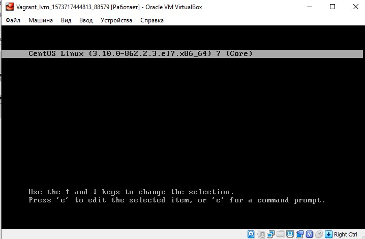

# Загрузка Linux
## Попасть в систему без пароля

Иногда возникает необходимость попасть в систему с правами привелигерованного пользователя и при этом у нас отсутсвует пароль к системной записи **root**
Есть как минимум 3 способа получить доступ к системной записи **root**не имея пароля. Для этого необходимо получить доступ к консоли сервера, перезагрузить сервер и в момент выбора ядра
нажать клавишу **е** для того чтобы войти в режим **edit**



и отредактировать соответствующие параметры загрузки ядра

### Первый способ

Использовать в параметрах загрузки ядра опцию ***init=/bin/sh*** для этого в параметрах загрузки находим строку начинающуюся с **linux16** и в конце нее добавляем параметр *init=/bin/sh* после чего нажимаем комбинацию клавиш **Ctrl+x** для того чтобы произвести загрузку системы.
(В нашем образе VM полученном с помощью vagrant файла в параметрах загрузки ядра необходимо убрать параметр ***console=ttyS0,115200n8***
отвечающий за подключение из консоли посредством команды **vagrant ssh** данный параметр позволяет подключаться к системе с использованием порта **Serial 0** и задает параметры подключения)

Особенность состоит в том что корневая система при этом смонтирована в режиме **RO** (*Read Only*)  и если необходимо внести в нее изменения ее нужно перемонтировать в режиме **RW** (*Read Write*)
Для того чтобы перемонтировать файловую систему используется команда ***mount -o remount,rw /*** проверить что система смонтировалась в режиме **RW** можно проверить изменив любой файл или
используя команду ***mount | grep root***
Еще один способ получить файловую систему сразу смонтированную в режиме **RW** при добавлении в параметры загруазки ядра опции ***init=/bin/sh*** изменить опции монтирования системы. Для нашего обрарза это будет *... root=/dev/mapper/VolGroup00/LogVol00 ro ...* для монтирования корневого раздела в режиме **RW** в парамтре ***root*** в концестроки вместо ***ro*** указываем ***rw*** получаем *... root=/dev/mapper/VolGroup00/LogVol00 rw ...*

### Второй способ

В параметрах загрузки в конце строки начинающейся с **linux16** добавляем ***rd.break*** и нажимаем сочетание клавиш **Ctrl+x** для загрузки системы. При этом происходит загрузка в **Emergency Mode**. Как и в прердыдущем случае для нашего образа VM в параметрах загрузки ядра необходимо убрать параметр ***console=ttyS0,115200n8***.

Корневая файловая система как и в прошлом случае смонтирована в режиме **RO** в папку **/sysroot**. Как правило данный способ загрузки применяют для смены забытого пароля для цчетной записи суперпользователя **root** Далее слердует демонстрация как это делается:

Перемонтируем файловую систему в режиме **RW** для этого воспользуемся командой ***mount -o remount,rw /sysroot*** с указанием каталога со смонтированной корневой системой

```bash
switch_root:/# mount -o remount,rw /sysroot
```

Производим смену корневой системы командой ***chroot***

```bash
switch_root:/# chroot /sysroot
```

Задаем пароль для учетной записи суперпользователя **root** командой ***passwd***

```bash
sh-4.2# passwd root
Changing password for user root.
New password:
Retype new password:
passwd: all authentication tokens updated successfully.
sh-4.2# touch /.autorelabel
```
Так же как и в первом случае корневую файловую систему можно смонтировать сразу в режиме **RW** если в парамерах загрузки ядра вместо *... root=/dev/mapper/VolGroup00/LogVol00 ro ...* указать *... root=/dev/mapper/VolGroup00/LogVol00 rw ...*

### Третий способ

В параметрах загруазки ядра в строке начинающейся с **linux16** после *... root=/dev/mapper/VolGroup00/LogVol00 ...* вместо параметра *ro* указываем *rw init=/sysroot/bin/sh*. Так же как и в первых двух случаях необходимо из строки параметров загрузки ядра убрать параметр ***console=ttyS0,115200n8***.
В целом данный способ выдает такой же результат как и способ №2 при применении в параметрах загрузки ядра указателя *rw* после *... root=/dev/mapper/VolGroup00/LogVol00 ...* корневая файловая система оказывается смонтированной в режиме **RW** в каталог **/sysroot**.

## Установить систему с LVM, после чего переименовать VG

Войдем в систему с привилегией суперапользователя для чего используем команду ***sudo*** с ключем ***-i*** и проверим имя нашей **VG** используя команду ***vgs***

```bash
[vagrant@lvm ~]$ sudo -i
[root@lvm ~]# vgs
  VG         #PV #LV #SN Attr   VSize   VFree
  VolGroup00   1   2   0 wz--n- <38.97g    0
```

Переименуем нашу **VG** используя команду ***vgrename VolGroup00 OtusRoot*** здесь:

- ***VolGroup00*** - текущее имя **VG**;
- ***OtusRoot*** - имя на которое мы хотим изменить текущее имя **VG**.

```bash
[root@lvm ~]# vgrename VolGroup00 OtusRoot
  Volume group "VolGroup00" successfully renamed to "OtusRoot"
```

Для того чтобы завершить переименование **VG** необходимо изменить имя **VG** на новое в следующих файлах:

- ***/etc/fstab***;
- ***/etc/default/grub***;
- ***/boot/grub2/grub.cfg***.

Для изменения файлов воспользуемся встроенным редактором **VI**

```bash
[root@lvm ~]# vi /etc/fstab
[root@lvm ~]# vi /etc/default/grub
[root@lvm ~]# vi /boot/grub2/grub.cfg
```

После этого необходимо пересоздать **initrd image** чтобы он знал новое название нашей **VG** для этого используется команда ***mkinitrd -f -v /boot/initramfs-$(uname -r).img $(uname -r)***

```bash
[root@lvm ~]# mkinitrd -f -v /boot/initramfs-$(uname -r).img $(uname -r)
Executing: /sbin/dracut -f -v /boot/initramfs-3.10.0-862.2.3.el7.x86_64.img 3.10.0-862.2.3.el7.x86_64
dracut module 'busybox' will not be installed, because command 'busybox' could not be found!
dracut module 'crypt' will not be installed, because command 'cryptsetup' could not be found!
dracut module 'dmraid' will not be installed, because command 'dmraid' could not be found!
dracut module 'dmsquash-live-ntfs' will not be installed, because command 'ntfs-3g' could not be found!
dracut module 'multipath' will not be installed, because command 'multipath' could not be found!
dracut module 'busybox' will not be installed, because command 'busybox' could not be found!
dracut module 'crypt' will not be installed, because command 'cryptsetup' could not be found!
dracut module 'dmraid' will not be installed, because command 'dmraid' could not be found!
dracut module 'dmsquash-live-ntfs' will not be installed, because command 'ntfs-3g' could not be found!
dracut module 'multipath' will not be installed, because command 'multipath' could not be found!
*** Including module: bash ***
*** Including module: nss-softokn ***
*** Including module: i18n ***
*** Including module: drm ***
*** Including module: plymouth ***
*** Including module: dm ***
Skipping udev rule: 64-device-mapper.rules
Skipping udev rule: 60-persistent-storage-dm.rules
Skipping udev rule: 55-dm.rules
*** Including module: kernel-modules ***
Omitting driver floppy
*** Including module: lvm ***
Skipping udev rule: 64-device-mapper.rules
Skipping udev rule: 56-lvm.rules
Skipping udev rule: 60-persistent-storage-lvm.rules
*** Including module: qemu ***
*** Including module: resume ***
*** Including module: rootfs-block ***
*** Including module: terminfo ***
*** Including module: udev-rules ***
Skipping udev rule: 40-redhat-cpu-hotplug.rules
Skipping udev rule: 91-permissions.rules
*** Including module: biosdevname ***
*** Including module: systemd ***
*** Including module: usrmount ***
*** Including module: base ***
*** Including module: fs-lib ***
*** Including module: shutdown ***
*** Including modules done ***
*** Installing kernel module dependencies and firmware ***
*** Installing kernel module dependencies and firmware done ***
*** Resolving executable dependencies ***
*** Resolving executable dependencies done***
*** Hardlinking files ***
*** Hardlinking files done ***
*** Stripping files ***
*** Stripping files done ***
*** Generating early-microcode cpio image contents ***
*** No early-microcode cpio image needed ***
*** Store current command line parameters ***
*** Creating image file ***
*** Creating image file done ***
*** Creating initramfs image file '/boot/initramfs-3.10.0-862.2.3.el7.x86_64.img' done ***
```

После этого перезагруажаем компьютер и после перезагрузки проверяем с помощью команды ***vgs***

```bash
[root@lvm ~]# vgs
  VG       #PV #LV #SN Attr   VSize   VFree
  OtusRoot   1   2   0 wz--n- <38.97g    0
```

Точно таким же образом можно переименовать и **LV**


## Добавить модуль в initrd

Для того чтобы добавить модуль в **initrd** необходимо для начала поместить скрипт с данным модулем  в каталог **/usr/lib/dracut/modules.d/**. Для добавления своего модуля создаем в этом каталоге папку с именем добавляемого модуля. В нашем случае это будет папка **01test**

```bash
[root@lvm ~]# mkdir /usr/lib/dracut/modules.d/01test
```

Поместим в эту папку два скрипта:

- **module-setup.sh** -устанавливает модуль и вызывает скрипт **test.sh**
- **test.sh** - рисует пингвина

Пересобираем образ **initrd** для этого используем команду ***dracut*** с ключами ***-f*** и ***-v***

другой вариант использовать команду ***mkinitrd -f -v /boot/initramfs-$(uname -r).img $(uname -r)***

```bash
[root@lvm ~]# dracut -f -v
Executing: /sbin/dracut -f -v
dracut module 'busybox' will not be installed, because command 'busybox' could not be found!
dracut module 'crypt' will not be installed, because command 'cryptsetup' could not be found!
dracut module 'dmraid' will not be installed, because command 'dmraid' could not be found!
dracut module 'dmsquash-live-ntfs' will not be installed, because command 'ntfs-3g' could not be found!
dracut module 'multipath' will not be installed, because command 'multipath' could not be found!
dracut module 'busybox' will not be installed, because command 'busybox' could not be found!
dracut module 'crypt' will not be installed, because command 'cryptsetup' could not be found!
dracut module 'dmraid' will not be installed, because command 'dmraid' could not be found!
dracut module 'dmsquash-live-ntfs' will not be installed, because command 'ntfs-3g' could not be found!
dracut module 'multipath' will not be installed, because command 'multipath' could not be found!
*** Including module: bash ***
*** Including module: test ***
*** Including module: nss-softokn ***
*** Including module: i18n ***
*** Including module: drm ***
*** Including module: plymouth ***
*** Including module: dm ***
Skipping udev rule: 64-device-mapper.rules
Skipping udev rule: 60-persistent-storage-dm.rules
Skipping udev rule: 55-dm.rules
*** Including module: kernel-modules ***
Omitting driver floppy
*** Including module: lvm ***
Skipping udev rule: 64-device-mapper.rules
Skipping udev rule: 56-lvm.rules
Skipping udev rule: 60-persistent-storage-lvm.rules
*** Including module: qemu ***
*** Including module: resume ***
*** Including module: rootfs-block ***
*** Including module: terminfo ***
*** Including module: udev-rules ***
Skipping udev rule: 40-redhat-cpu-hotplug.rules
Skipping udev rule: 91-permissions.rules
*** Including module: biosdevname ***
*** Including module: systemd ***
*** Including module: usrmount ***
*** Including module: base ***
*** Including module: fs-lib ***
*** Including module: shutdown ***
*** Including modules done ***
*** Installing kernel module dependencies and firmware ***
*** Installing kernel module dependencies and firmware done ***
*** Resolving executable dependencies ***
*** Resolving executable dependencies done***
*** Hardlinking files ***
*** Hardlinking files done ***
*** Stripping files ***
*** Stripping files done ***
*** Generating early-microcode cpio image contents ***
*** No early-microcode cpio image needed ***
*** Store current command line parameters ***
*** Creating image file ***
*** Creating image file done ***
*** Creating initramfs image file '/boot/initramfs-3.10.0-862.2.3.el7.x86_64.img' done ***
```

Посмотреть какие модули загружены в образ можно командой ***lsinitrd -m /boot/initramfs-$(uname -r).img | grep test***

```bash
[root@lvm ~]# lsinitrd -m /boot/initramfs-$(uname -r).img | grep test
test
```

Для проверки перезапускаем виртуальнуюмашину и в графической оболочке VirtuaBox в параметрах загрузки VM в конце строки начинающейся с **linux16** удаляем параметры *rghb* и *quiet*
